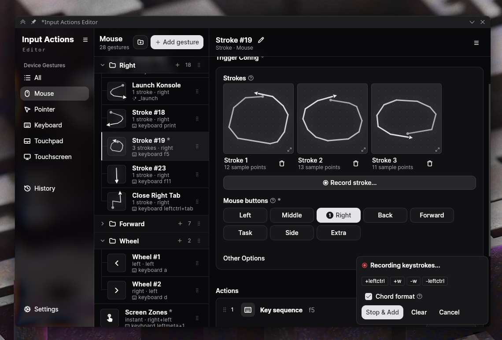

<h1 align="center">Input Actions Editor</h1>

<p align="center">A desktop GUI for configuring <a href="https://github.com/taj-ny/InputActions">Input Actions</a>.</p>




## Features

- Stroke recording and path visualization, recorded from the daemon over D-Bus.
- Plasma shortcut picker.
- Multiple actions per gesture, run in order.
- Grouping and reordering for long gesture lists.
- Nested conditions on both triggers and actions.
- Conflict detection while editing.
- Supported action types configuration: 
    - Run a command 
    - Send input (Keyboard/Mouse) 
    - Trigger a Plasma shortcut 
    - Sleep 
    - Activate window
    - Replace text

## Installation

### Fedora

Packages are published on [Copr](https://copr.fedorainfracloud.org/coprs/luwxs/input-actions-editor/):

```sh
sudo dnf copr enable luwxs/input-actions-editor
sudo dnf install input-actions-editor
```

On other distributions, build from source as described below or download the binaries from Github releases.

## Building

You'll need the Flutter SDK installed and set up for Linux desktop builds.

```sh
flutter pub get
dart run build_runner build --delete-conflicting-outputs
```

Release build (output lands in `build/linux/x64/release/bundle/`):

```sh
flutter build linux --release
```

### KDE helpers

The `kde_icon_lookup` and `kde_key_lookup` helpers need Qt 6 and KDE Frameworks 6 to compile. They are optional: without these libraries the build skips them and the app still runs, just without native KDE icon and key resolution. On Fedora:

```sh
sudo dnf install qt6-qtbase-devel kf6-kiconthemes-devel kf6-kservice-devel
```